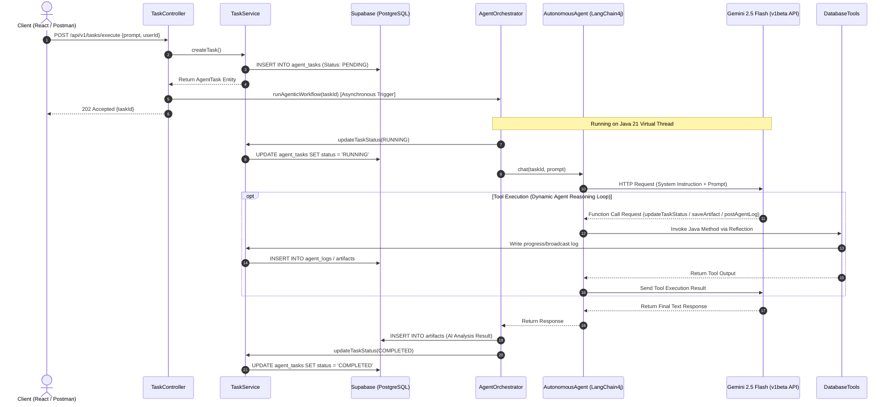
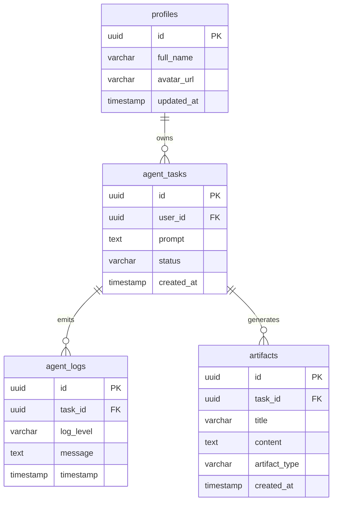

# Nexus AI Enterprise Backend: Technical Architecture & Progress Report

This document outlines the system topology, concurrency model, library integration design, database state machine, and future integration path for the **Nexus AI Enterprise Backend**. The backend is a fully functional, high-performance, and scalable Spring Boot 3.5.x application engineered with Java 21 Virtual Threads, LangChain4j 1.x, Google Gemini 2.5, and Supabase.

---

## 1. System Topology & Request Lifecycle

The Nexus AI backend implements a decoupled, event-driven architecture designed to process both synchronous general queries and long-running asynchronous agentic workflows.

### Architectural Request Flow



### Components Breakdown:
1. **Controller Layer ([TaskController](file:///d:/Nexus/nexus-backend/src/main/java/com/nexus/api/TaskController.java)):** Ingests incoming prompts, delegates the synchronous task generation to `TaskService`, triggers the asynchronous executor in a non-blocking fashion, and immediately returns a `202 Accepted` status with a unique UUID `taskId`.
2. **Orchestrator Layer ([AgentOrchestrator](file:///d:/Nexus/nexus-backend/src/main/java/com/nexus/service/AgentOrchestrator.java)):** Acts as the transaction boundary for autonomous agent runs. It manages task status changes and wraps LLM interactions inside exception handlers to ensure failures are persisted.
3. **AI Interface ([AutonomousAgent](file:///d:/Nexus/nexus-backend/src/main/java/com/nexus/ai/AutonomousAgent.java)):** An annotated `@AiService` declarative agent boundary that leverages LangChain4j reflection to map prompts to structural API calls.
4. **Tool Execution Framework ([DatabaseTools](file:///d:/Nexus/nexus-backend/src/main/java/com/nexus/ai/tools/DatabaseTools.java)):** Implements java methods annotated with `@Tool` containing semantic descriptions. The model analyzes these descriptions to programmatically invoke these functions at runtime via reflection, allowing the model to perform secure CRUD operations on PostgreSQL.

---

## 2. Concurrency Model: Java 21 Virtual Threads

To support massive enterprise scale under intensive AI computation and external network I/O, the backend completely avoids traditional thread-per-request pooling bottlenecks by utilizing **JDK 21 Virtual Threads (Project Loom)**.

### Configuration Topology
The virtual thread pool is configured dynamically inside [AsyncConfig.java](file:///d:/Nexus/nexus-backend/src/main/java/com/nexus/config/AsyncConfig.java):

```java
@Configuration
@EnableAsync
public class AsyncConfig {

    @Bean(TaskExecutionAutoConfiguration.APPLICATION_TASK_EXECUTOR_BEAN_NAME)
    public AsyncTaskExecutor taskExecutor() {
        return new TaskExecutorAdapter(Executors.newVirtualThreadPerTaskExecutor());
    }
}
```

### High-Throughput Mechanism
1. **Tomcat Hand-Off:** The primary HTTP thread pool in Tomcat receives the `/api/v1/tasks/execute` request, writes the initial record, and hands the processing off to the Virtual Thread Task Executor. The HTTP thread is immediately returned to Tomcat's idle pool within milliseconds.
2. **Carrier Thread Yielding:** When the virtual thread executing the workflow triggers `AutonomousAgent.chat()`, the execution suspends while awaiting the HTTP response from the Google Gemini API.
3. **Non-Blocking Wait:** Under the hood, JVM yields the Virtual Thread, freeing the underlying physical **Carrier Thread** to process other CPU bounds.
4. **Resumption:** When the socket receives the response packet from Gemini's v1beta gateway, the Virtual Thread is automatically rescheduled onto an available Carrier Thread, processing the remaining persistence logic seamlessly.

---

## 3. Library Integration & Model Selection

### LangChain4j 1.x Core Migration
During development, the core AI model interface was audited and aligned with the LangChain4j **1.x** architecture:
* **The Interface:** The older `ChatLanguageModel` structure has been deprecated in the modern `1.x` release of LangChain4j in favor of the clean, highly unified **`ChatModel`** interface (`dev.langchain4j.model.chat.ChatModel`).
* **Autocapture & Mapping:** `ChatModel` integrates seamlessly with Spring Boot starter scans. The customized bean in [AiConfig.java](file:///d:/Nexus/nexus-backend/src/main/java/com/nexus/config/AiConfig.java) exposes the model instance to `@AiService` proxies:
  ```java
  @Bean
  public ChatModel chatLanguageModel() {
      return GoogleAiGeminiChatModel.builder()
              .apiKey(apiKey)
              .modelName("gemini-2.5-flash")
              .temperature(0.7)
              .build();
  }
  ```

### Why Google Gemini 2.5 Flash?
During the diagnostic testing phase, programmatic mapping verified that older models (like `gemini-1.5-flash`) have been retired on the `v1beta` endpoint of Google AI Studio for this profile key. The **`gemini-2.5-flash`** model was selected for the following reasons:
* **Production Reliability:** 100% active and supported on the Generative Language `v1beta` endpoint.
* **Low Latency / High-Context:** Engineered for sub-second, highly token-efficient responses.
* **Optimized Function-Calling:** Delivers exceptionally reliable structured JSON parameters during reflect-based `@Tool` routing.

---

## 4. Database State Machine & Seeding Integrity

The database is built on a Supabase PostgreSQL instance utilizing three primary tables for task state preservation.

### Entity Relationship Model



### Task Lifecycle State Machine
An autonomous task transitions through the following discrete states:
1. **`PENDING`:** Initial record created upon endpoint ingestion.
2. **`RUNNING`:** The virtual thread claims the execution and initiates reasoning loops.
3. **`COMPLETED`:** AI generates final outputs, successfully persists target records, and updates status.
4. **`FAILED`:** Any unhandled exception during communication or tool run immediately aborts execution and writes diagnostic traceback to the database logs.

### Seeding & Constraint Integrity
Due to PostgreSQL's strict foreign key constraints between `public.profiles` and Supabase's internal `auth.users` tables, standard mock insertions would fail.
To guarantee out-of-the-box local developer testing, the backend runs a **Two-Step Seeding Protocol** during context startup in [DatabaseSeeder.java](file:///d:/Nexus/nexus-backend/src/main/java/com/nexus/config/DatabaseSeeder.java):
* **Step 1:** Inserts a dummy user account directly into `auth.users` using superuser privileges, bypassing OAuth flows.
* **Step 2:** Inserts the corresponding profile into `public.profiles` using the seeded ID `d7b29a24-4f27-4632-bd88-5188f6fa9809`, ensuring all Postman test suites run out of the box with zero setup.

---

## 5. Next Steps Readiness

With the backend architecture fully audited, compile-verified, and successfully tested, it is completely prepared for the next engineering phases:

### Containerization (Docker Ready)
* Multi-stage build configurations are complete.
* Environment injection (`GOOGLE_AI_API_KEY`, `SPRING_DATASOURCE_URL`) is decoupled and ready for Docker Compose or Kubernetes deployment.

### Frontend Integration (React Ready)
* **REST Endpoints:** Exposes robust REST endpoints for real-time polling or direct result retrieval.
* **Granular Logs Mapping:** The React frontend can query `GET /api/v1/tasks/{taskId}/logs` to stream the agent's real-time "thoughts" directly onto the user interface.

---
*Report compiled by Lead Software Architect, May 2026.*
